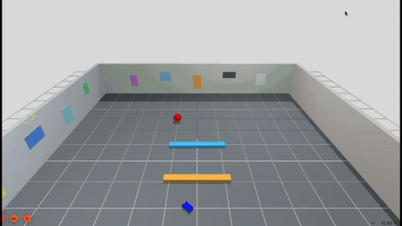
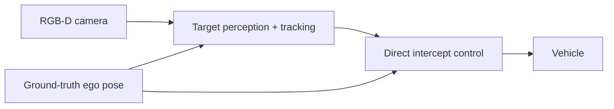
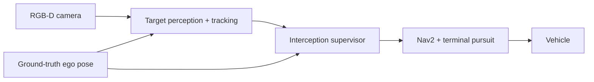
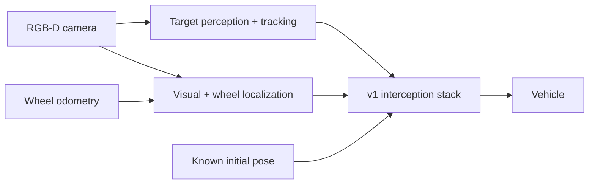

# Target Interception Simulation

ROS 2 simulation for moving object (red ball) tracking and interception using an Ackermann car.  



## Architecture

We incrementally increase the complexity of the scenario (v0, v1, v2) to validate simpler logic and theory before moving onto more complexity. All versions have the same RGB-D perception and target-tracking pipeline; what change is the ego-pose source, command structure, and world complexity.

| Package | Description |
| --- | --- |
| `robot_description` | Ackermann vehicle geometry and static sensor extrinsics |
| `robot_sim` | Gazebo arena, sensors, bridges, control, and trial evaluation |
| `robot_interfaces` | Stamped 2D target-detection message |
| `robot_perception` | HSV detection and synchronized RGB-D projection |
| `robot_tracking` | Constant-velocity target Kalman filter |
| `robot_navigation` | Intercept solve and direct Ackermann pursuit control |
| `robot_odometry` | Wheel/RGB-D ego odometry fusion and initial map alignment |

### Vehicle
Ackermann vehicle has a constant forward velocity, with steering 
is limited by the 0.24m wheelbase and 0.6rad steering limit; linear acceleration and
deceleration are also bounded. We assume the target is initially visible.

### v0. Open Space



#### Scenario

The vehicle directly pursues a red ball moving at 0.4 m/s on a 3 m circle in an
empty 12 × 12 m arena. Target position comes from RGB-D perception, while ego
pose comes from ground truth. The constant-velocity target filter is
intentionally model-mismatched with the circular motion.

### v1. Obstacles



#### Scenario

The same moving target is placed in an arena with two fixed obstacles.
Nav2 routes toward predicted intercept goals using the known static map, then
hands control to direct terminal pursuit near the target. Ego pose remains
ground truth; obstacles are map-known and are not sensed dynamically.

### v2. Localization



#### Scenario

v2 reuses the v1 arena, target motion, and navigation strategy, but replaces
application use of ego truth with fused wheel and RGB-D odometry. A launch-time
`map -> odom` transform seeds the known initial pose; ground-truth robot and
target odometry are reserved for trial evaluation.

## Bringup

Linux:

```bash
xhost +si:localuser:root
docker compose up --build
```

Set `SCENARIO` to select another launch stack. The supported values are `v0`,
`v1`, and `v2`:

```bash
SCENARIO=v2 docker compose up --build
```

## Results

We run ten trials scenarios that vary the target phase and vehicle pose while keeping the target initially visible.

- **v0:** Target captured in all 10 scenarios. Capture times ranged from 4.47s to 7.99s, with target-position RMSE between 0.014m and 0.016m.
- **v1:** Target captured in all 10 scenarios with no reported fixed-obstacle contacts.
- **v2:** Target captured in 8 of 10 scenarios with no observed contacts. One trial timed out and one exceeded the process timeout, leaving localization data incomplete.

Across completed trials:
- Position RMSE ranged from 0.158 m to 0.403 m
- Yaw RMSE from 0.072 rad to 0.324 rad
- Final position error from 0.072 m to 0.650 m
- Localization availability from 91.8% to 99.5%

## Roadmap

| Version | Increment |
| --- | --- |
| v0 | Open-space interception using ego ground truth |
| v1 | Obstacles and Nav2 for mid-course routing, with direct terminal pursuit |
| v2 | Fused wheel/RGB-D ego odometry with known initial map alignment |
| v3 | Search, loss recovery, reset handling, and explicit mission states **(WIP)** |  
